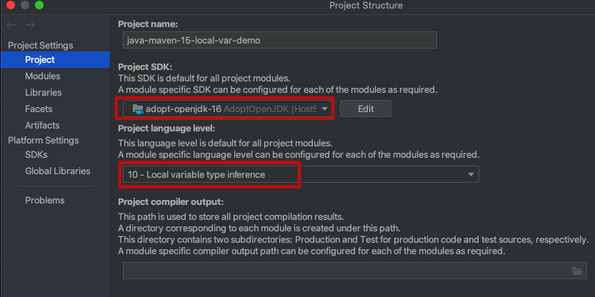

Java Maven jdk-10 Local Var Demo
=================================

Jdk10支持局部变量类型推导，可以使用`var`来声明一个局部变量。

为了在IDE和build中支持该语法，需要：
1. Maven中`maven.compiler.source`至少设置为`10`
2. IDEA中也有相应设置



注：由于现在很难下载到10的jdk了，所以这里选择的是16


```
mvn clean install
```

